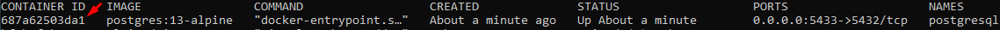

# Avaliação Sicredi API
Este documento se refere ao processo de configuração de ambiente para levantar a aplicação.

# Banco de dados

Instalar Docker: [get-started](https://docs.docker.com/get-started/)

Após concluída a instalação do docker, rodar linha de comando em um terminal (use o terminal de sua preferência) para subir o container do banco de dados do postgres.

`docker run -d -p 5433:5432 --name postgresql -e POSTGRES_PASSWORD=123456 -e POSTGRES_DB=sicredi_avaliacao postgres:13-alpine`

O banco para usar a aplicação localmente está criado, mas vamos criar o banco para os testes de API (Um banco exclusivo para testes de API)

Após subir o container use o comando para lista-lo

`docker ps -a`

Copie o conteiner id e execute o comando abaixo.

`docker exec -it container-id-copiado bash`

Com acesso ao bash rode o comando a seguir para acessar o postgres

`psql -U postgres`

Agora vamos dar o comando para criar a banco de dados de testes.

`CREATE DATABASE sicredi_avaliacao_test;`

Pronto, os bancos estão criados.

Você pode usar alguma ferramente grafica para vizualizar os bancos, como por exemplo [DBeaver](https://dbeaver.io/download/), ou alguma de sua preferência.

## Configurar ambiente:

#### Versão do java utilizado no projeto: 11

[Configuração de variaveis de ambiente do java](https://medium.com/beelabacademy/configurando-vari%C3%A1veis-de-ambiente-java-home-e-maven-home-no-windows-e-unix-d9461f783c26) 

Caso esteja usando a IDE intelliJ é possível informar qual SDK deseja utilizar no projeto:

Abrir projeto no IntelliJ: Clicar em: File -> Project Structure -> Project:
Em SDK: Adicionar "11 java version"

## Configurar perfil da API para levantar aplicação localmente
Alterar no application.yaml a propriedade de perfil ativo para dev (development):

    spring:
        profiles:
            active: dev

Ou adicionar options nas IDEs para setar o perfil

#### [IntelliJ] 
Abrir Run > Edit Configurations > Modify options > Add VM options = "-Dspring.profiles.active=dev".

#### [STS / Eclipse] 
Abrir Run > Run configurations > Arguments > VM Arguments = "-Dspring.profiles.active=dev".

## Subir a API
Após todo o processo acima ser finalizado, basta rodar a aplicação.